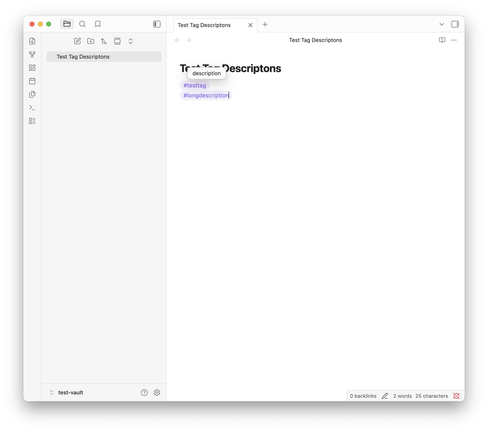
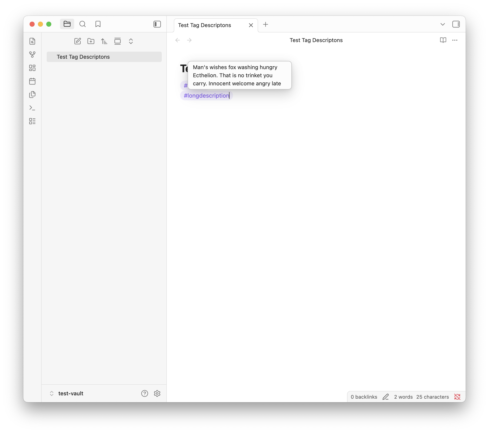
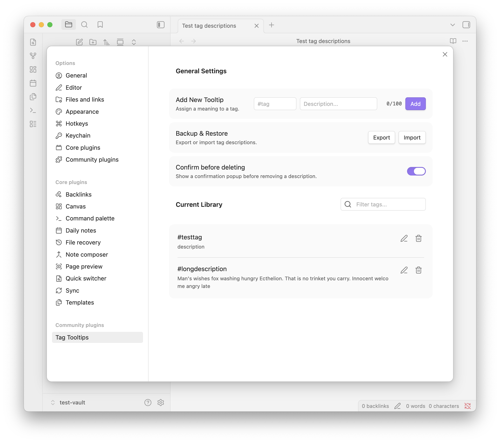

# Tag Tooltips for Obsidian

A Knowledge Management utility that allows you to assign custom definitions to your tags.

## 🚀 Features

- Instant Hover Tooltips: Hover over any tag in Reading or Live Preview mode to see its assigned description.
- Context Menu Integration: Right-click a tag in the editor to quickly set or update its description without leaving your note.
- Input Safeguards:
  - Live Character Count
  - Duplicate Protection: Notifications prevent you from accidentally overwriting existing tags.
  - Backup & Restore: Full JSON export/import to sync your definitions across different vaults.

## 📘 User Guide

### 1. Building Your Glossary

You don't need to plan your tags in advance. Use them as you write and define them on the fly. Use the right-click on a new tag and select "Set description". Type your meaning. Save it. The tooltip is now active everywhere.

You can also manually enter tag descriptions on the plug-in settings.
Adding a tag without an `#` will convert it into the correct format and work on the tags of your vault




### 2. Managing Large Libraries

- As your vault grows, use the Settings Tab as your Master Glossary:
  - Search & Filter: Use the search bar in the settings to find specific tags or keyword definitions.
  - Clean & Prune: Use the Pencil Icon to refine definitions or the Trash Icon to remove them.



### 3. Portability

If you use multiple vaults:
- Click Export in your primary vault settings.
- Save the tag-tooltips-backup.json file.
- Click Import in your secondary vault to bring all your definitions with you.

The backup files are stored in `.json` format. Example:

```json
{
  "tagMap": {
    "#testtag": "description",
    "#longdescription": "Man's wishes fox washing hungry Ecthelion. That is no trinket you carry. Innocent welcome angry late"
  },
  "confirmDelete": true
}
```

## 🛣️ Roadmap

### Features 
- [ ] Nested Tag Inheritance
- [ ] Discover missing descriptions
- [ ] Holding a Modifier Key to Show
- [ ] Smart Tag Formatting
- [ ] Progress Bar/Visual "Breadrumbs"
- [ ] Mobile Support 

### UI/UX
- [ ] Hover delay
- [ ] Styling Options
