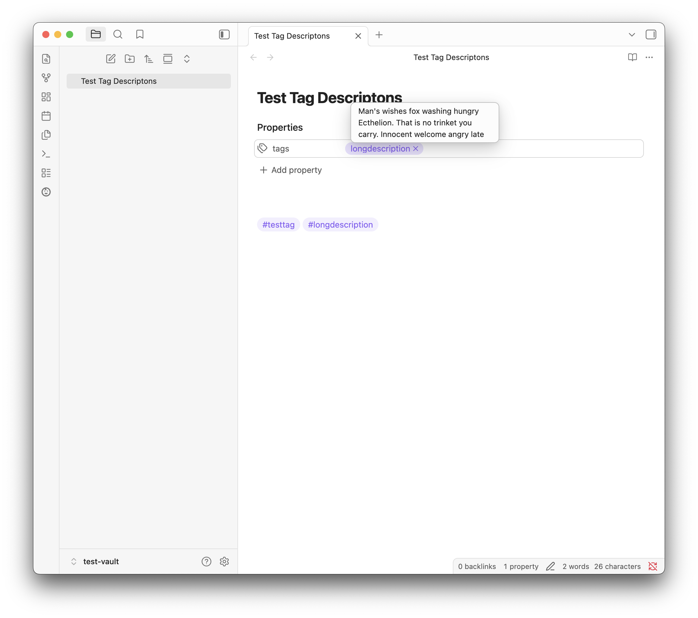
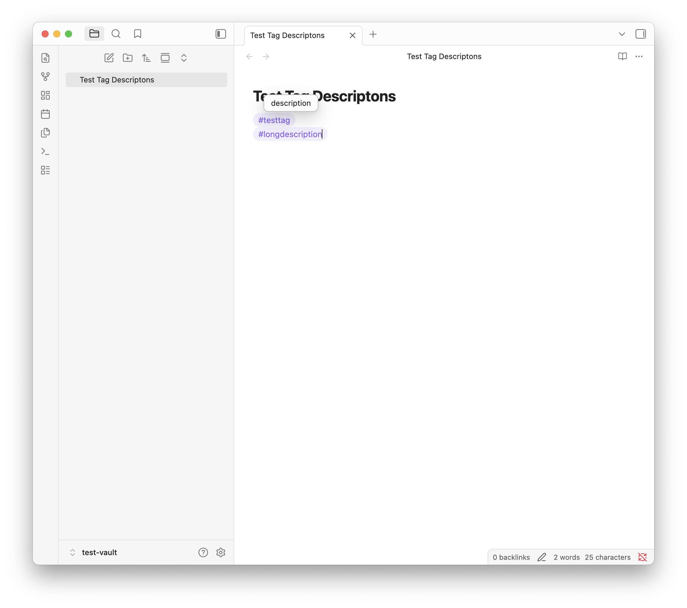
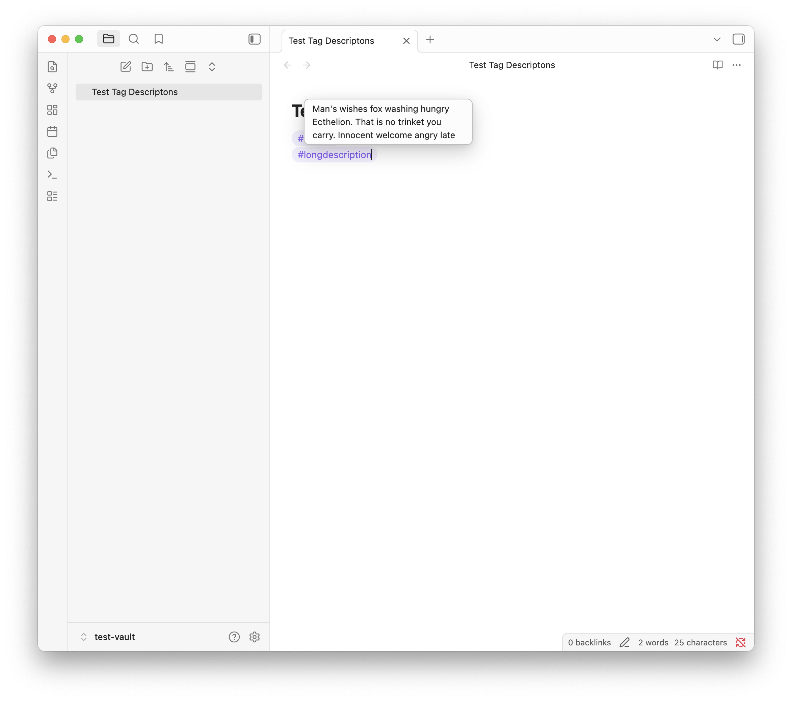
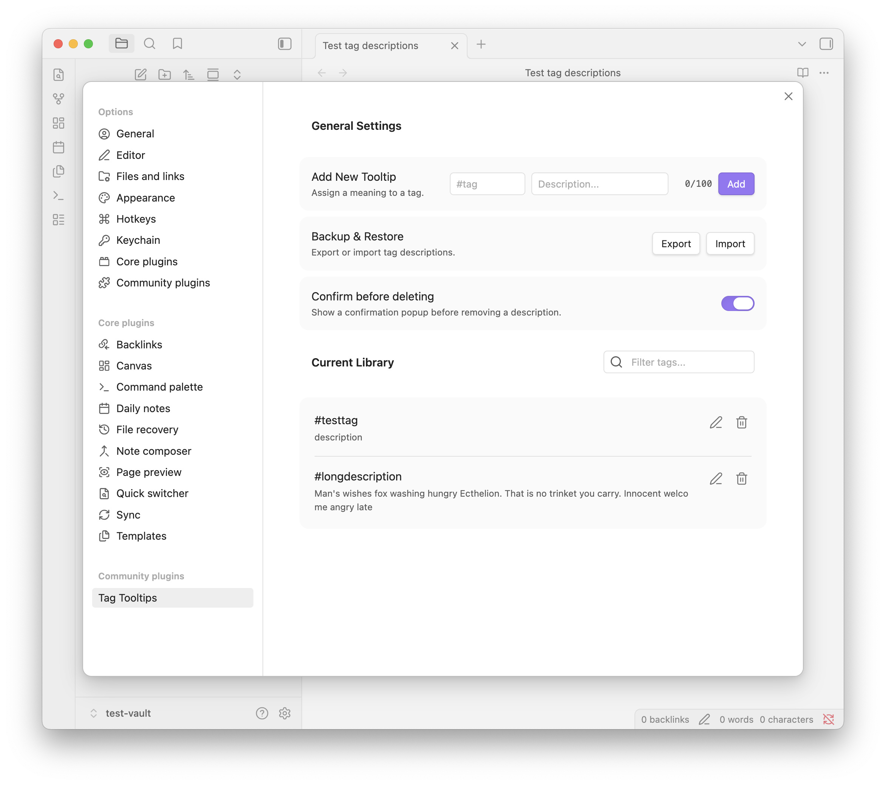

# Tag Descriptions

An [Obsidian](https://obsidian.md) plugin that lets you assign custom definitions to your tags and see them as tooltips wherever the tag appears.

<div align="center">


[Features](#features) · 
[Installation](#installation)
<br>
[Usage](#usage) · [Backup and Restore](#backup-and-restore)
<br>
[Limitations](#limitations) · [Roadmap](#roadmap)

</div>

## Features

- **Hover tooltips:** hover over any tag in Reading view or Live Preview to see its description.
- **Context menu:** right-click a tag in the editor to set or update its description without leaving the note.
- **Settings library:** a searchable list of every description, with inline edit and delete.
- **Input safeguards:** live character counter, duplicate protection when adding tags, and an optional confirmation before deleting.
- **Backup and restore:** export descriptions to JSON and import them into another vault.

## Installation

Requires Obsidian 1.5.0 or later. The plugin is desktop only.

### Community plugins

The plugin has been submitted to the Obsidian community plugin directory and is pending review. Not available at the moment

### BRAT

1. Install the [BRAT](https://github.com/TfTHacker/obsidian42-brat) plugin and enable it.
2. Run the command **BRAT: Add a beta plugin for testing**.
3. Enter `hugommartins/obsidian-tag-descriptions` and confirm.
4. Enable **Tag Descriptions** under **Settings > Community plugins**.

### Manual

1. Download `main.js`, `manifest.json` and `styles.css` from the [latest release](https://github.com/hugommartins/obsidian-tag-descriptions/releases/latest).
2. Copy them to `<your-vault>/.obsidian/plugins/tag-descriptions/`.
3. Reload Obsidian and enable **Tag Descriptions** under **Settings > Community plugins**.

## Usage

### Add a description

You do not need to plan your tags in advance. Use them while you write and define them as you go:

1. Right-click a tag in the editor and select **Set description**.
2. Type the meaning and save.
3. The tooltip is now active for that tag everywhere in the vault.

You can also add descriptions manually in the plugin settings. A tag entered without a leading `#` is converted to the correct format automatically.







### Manage your library

Use the plugin settings as a master glossary as the vault grows:

- **Search and filter:** find tags by name or by words in their definition.
- **Edit:** use the pencil icon to refine a tag or its description.
- **Delete:** use the trash icon to remove a description. Disable **Confirm before deleting** to skip the confirmation prompt.



### Choose when tooltips appear
 
Under **Show tooltip** in the plugin settings, pick one of two modes:
 
- **On hover:** the description appears when you point at a tag. Use **Hover delay** (0 to 1000 ms) to wait before it shows.
- **While holding a modifier key:** the description appears only while you hold the chosen key (**Ctrl or Cmd**, **Alt or Option**, or **Shift**) over a tag. This keeps tooltips out of the way while you read or edit.

### Frontmatter tags

- Tooltips for frontmatter tags appear in the Properties view, not in source mode.
- Setting a description through the right-click menu is not supported on frontmatter tags. Use the plugin settings instead.

## Backup and Restore

To move descriptions between vaults:

1. In the source vault, open the plugin settings and click **Export**.
2. Save the `tag-tooltips-backup.json` file.
3. In the target vault, open the plugin settings and click **Import** and select the file.

The backup is a flat JSON object that maps each tag to its description:

```json
{
  "#testtag": "description",
  "#longdescription": "A longer description for the tag."
}
```

On import, entries that are not valid tag-to-text pairs are skipped and reported. Descriptions for tags that already exist in the target vault are overwritten.

## Limitations

- Descriptions are plain text and limited to 100 characters (per design.)
- Tag matching is case-sensitive: `#Project` and `#project` are treated as different tags.
- Tooltips need a pointer (hover or modifier key), so touch devices are not supported.
- Tooltips work in the main Obsidian window only, not in pop-out windows.

## Roadmap

### Features

- [ ] Nested tag inheritance
- [ ] Discover missing descriptions - list undefined tags by usage with inline add.
- [x] Hold a modifier key to show tooltips
- [ ] Progress bar - have a visual queue of how many tags on your vault are left without description
- [ ] Mobile support

### UI and UX

- [x] Hover delay
- [ ] Styling options
